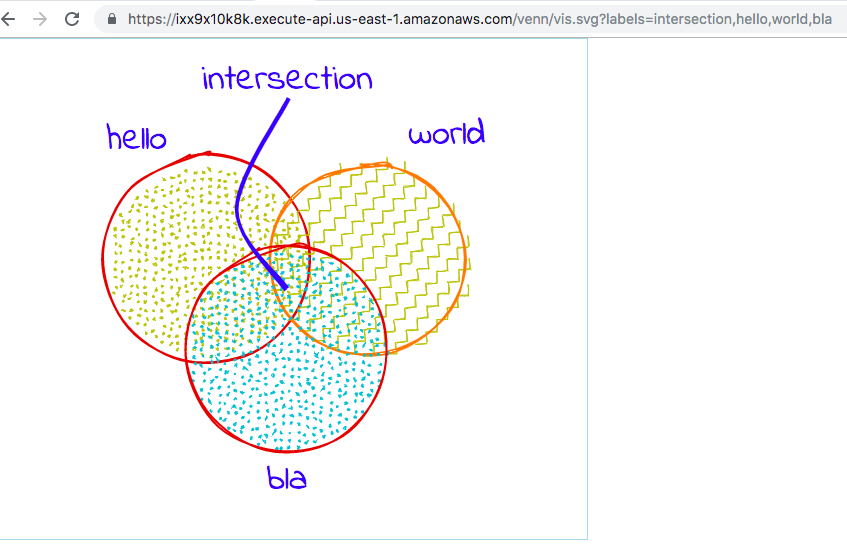

# venn-generator
An AWS lambda service that generates Venn diagram on the fly using [Rough.js](https://roughjs.com/).

## Demo

https://ixx9x10k8k.execute-api.us-east-1.amazonaws.com/venn/vis.svg?labels=intersection,hello,world,bla

Find the `labels` in URL (eg: `labels=intersection,hello,world,bla`), try changing it to something more clever, eg:

https://ixx9x10k8k.execute-api.us-east-1.amazonaws.com/venn/vis.svg?labels=success,hard work,luck

## What is this?

This is a venn diagram generator that uses custom labels provided by the user. Generated Venn diagram is an SVG string (browser can directly render it) or you can embed it to your website using an ``.

eg: ``

## How it works?

Request for a venn service hits AWS Gateway API, which triggers AWS Lambda function, which in turn, generates SVG string. [Rough.js](https://roughjs.com/) is used to generate handdrawn-like diagram. [Indie-Flower] (https://fonts.google.com/specimen/Indie+Flower) font was used to give a hand-written style. This font was embedded as base64 string in order to enable Venn diagram to be embedded as an image source.
